# T02: Copias de Seguridad en Linux con Duplicity

### Ahora empezaremos a hacer las copias de seguridad en Linux con un Ubuntu Server y con el disco duro adicional de 10 GB.

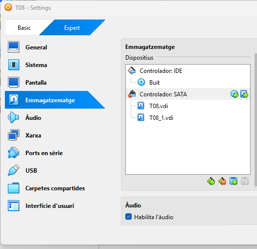

### Al entrar en la máquina Ubuntu vemos que nos aparece el segundo disco que hemos añadido.

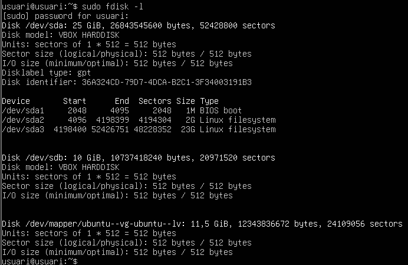

---

## 1. Creación de la partición

### Ahora deberemos crear una nueva partición en el disco.

```bash
sudo fdisk /dev/sdb
````

### Pasos:
- n (nueva partición)  
- p (primaria)  
- ENTER (valores por defecto)  
- w (guardar)

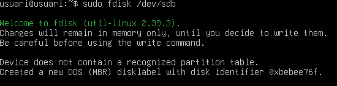

### Y ahora podemos ver que se ha creado correctamente.

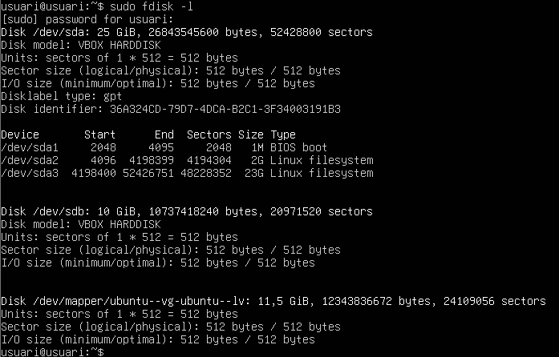

---

## 2. Formato y montaje

### Y ahora le daremos formato XFS con el siguiente pedido:

```bash
sudo mkfs.xfs /dev/sdb1
````

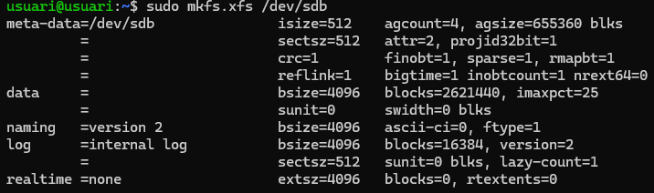

### Una vez con el disco duro formateado, creamos el punto de montaje manualmente en `/media/backup`.

### Creamos la carpeta.

```bash
sudo mkdir -p /media/backup
```

### Y después hacemos el montaje manualmente.

```bash
sudo mount /dev/sdb1 /media/backup
```

---

## 3. Instalación de Duplicity

```bash
sudo apt install duplicity
```

### Comprobamos que se ha instalado correctamente:

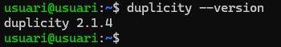

---

## 4. Creación de usuarios

### Crearemos un par de usuarios con carpeta personal:

```bash
sudo useradd -m -s /bin/bash usuario2
sudo useradd -m -s /bin/bash usuario3
```

### Creamos contraseña para iniciar sesión:

```bash
sudo passwd usuario2
sudo passwd usuario3
```

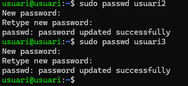

---

## 5. Creación de archivos de prueba

### Crearemos 4 archivos de 10 MB en la carpeta hombre del usuario principal.

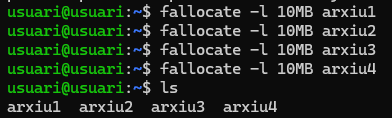

---

## 6. Copia completa

### Hacemos la copia de seguridad de la carpeta /home:

```bash
sudo duplicity full /home/ file:///media/backup/
````

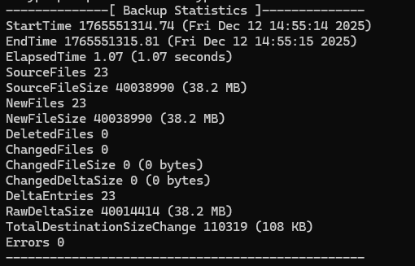

### Y podemos ver que se han creado los archivos de la copia de seguridad en la ubicación que le hemos indicado, en este caso el disco secundario.

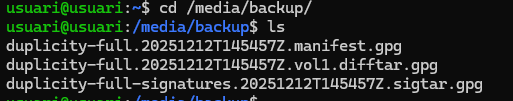

---

## 7. Restauración de datos

### Borramos los archivos de prueba:

```bash
rm archivo*
````

Hagamos la restauración:

```bash
sudo duplicity restore file:///media/backup/ /home/usuario
````

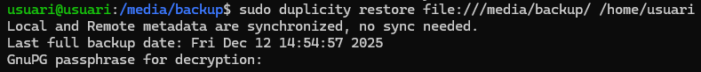

### Y podemos ver que se han restaurado correctamente.

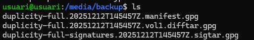

---

## 8. Copia incremental

### Añadimos un nuevo archivo de 4 MB:

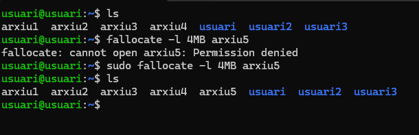

### Hagamos una nueva copia: detecta sólo 1 archivo nuevo y hace una copia incremental.

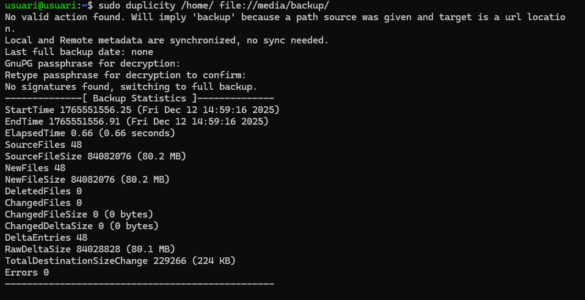

---

## 5. Creación de archivos de prueba

### Crearemos 4 archivos de 10 MB en la carpeta hombre del usuario principal.


---

## 6. Copia completa

### Hacemos la copia de seguridad de la carpeta /home:

```bash
sudo duplicity full /home/ file:///media/backup/
````


### Y podemos ver que se han creado los archivos de la copia de seguridad en la ubicación que le hemos indicado, en este caso el disco secundario.


---

## 7. Restauración de datos

### Borramos los archivos de prueba:

```bash
rm archivo*
````

Hagamos la restauración:

```bash
sudo duplicity restore file:///media/backup/ /home/usuario
````


### Y podemos ver que se han restaurado correctamente.


---

## 8. Copia incremental

### Añadimos un nuevo archivo de 4 MB:


---

## 9. Script de còpia automàtica

### Desmontamos la unidad del backup:

```bash
sudo umount /media/backup
```

### Creamos el script denominado `fullbackup.sh`:

```bash
!/bin/bash

export PASSPHRASE="usuariusuari1234"

mount /dev/sdb1 /media/backup

duplicity full /home file:///media/backup/homebackup

umount /media/backup
```

### Damos permisos de ejecución:

```bash
sudo chmod +x fullbackup.sh
```

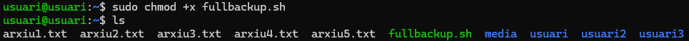

---

## 10. Programació amb CRON

### Programamos el crot como root para que se ejecute a las 23:00.

```bash
sudo crontab -e
```

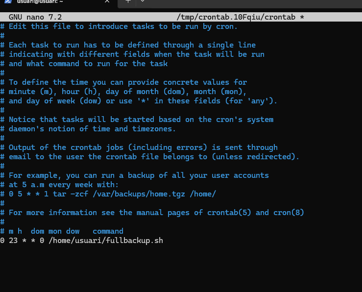

## 11. Script de copia automática de forma incremental

### Creamos el script `incrementalbackup.sh` para copias incrementales:

```bash
!/bin/bash

export PASSPHRASE="usuariusuari1234"

mount /dev/sdb1 /media/backup

duplicity incremental /home file:///media/backup/homebackup

umount /media/backup
```

### Damos permisos de ejecución:

```bash
sudo chmod +x incrementalbackup.sh
```

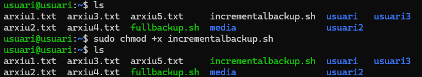

## 12. Programación con CRON

### Programamos cron para que se ejecute de lunes a sábado a las 23:00:

```bash
sudo crontab -e
```

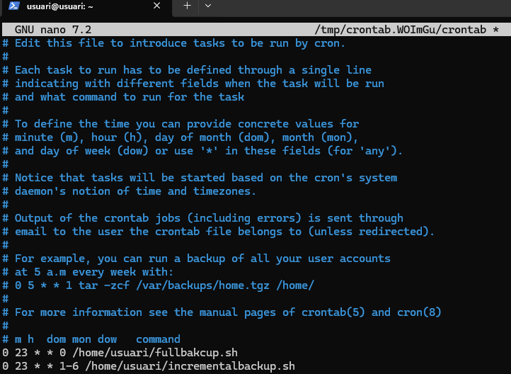

[Volver a enunciado](README.md)
[**Volver al proyecto**](../README.md)
