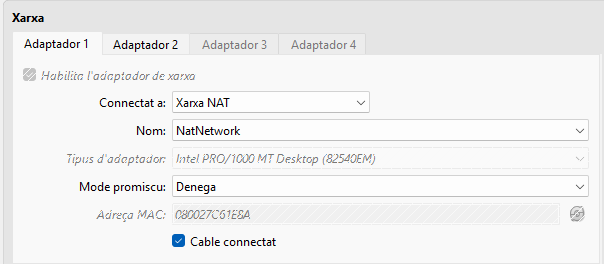
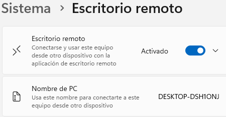
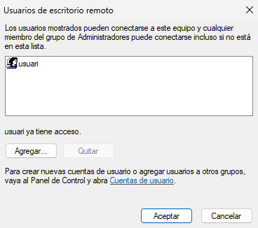
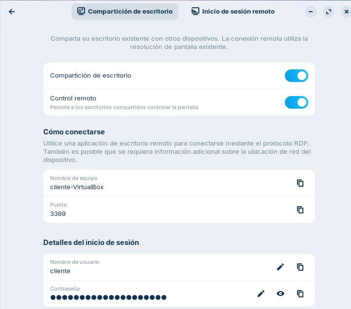
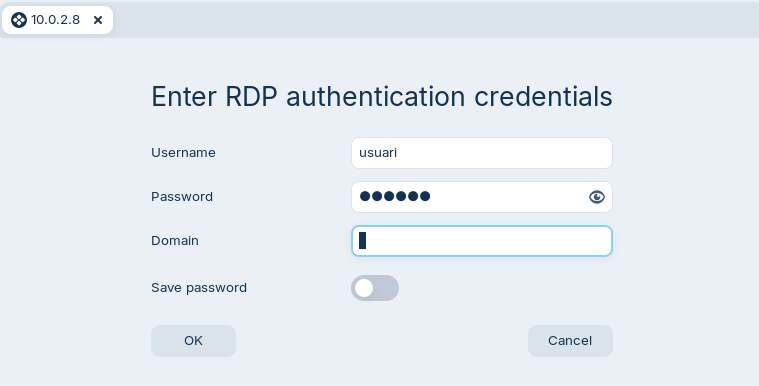
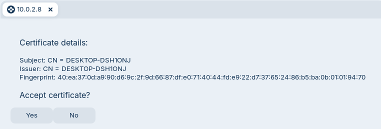
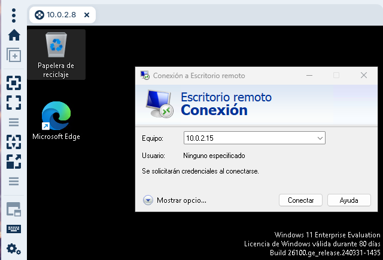
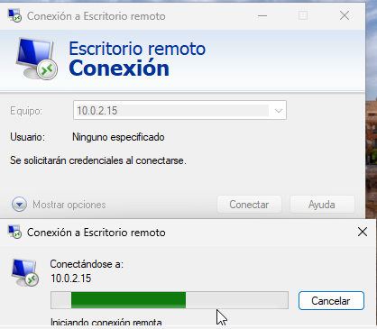
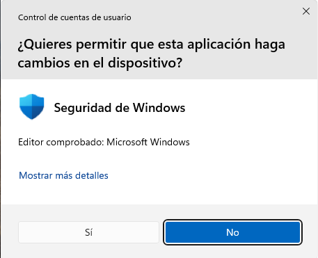

# T06: Acceso remoto. Escritorio remoto (RDP) 

---

## Red

Para que las dos máquinas virtuales puedan verse y tengan conexión a internet, he configurado la red en modo NAT.

En mi caso utilizo **red NAT** para que las máquinas tengan conexión y se puedan comunicar entre ellas sin configurar nada complejo. Esta configuración permite que tanto Windows como Zorin tengan internet y al mismo tiempo se detecten en la misma red virtual.

---

## Configuración a Windows

En Windows es necesario activar la opción de escritorio remoto para que otro dispositivo pueda conectarse. Esta opción se encuentra en la configuración del sistema en el apartado de escritorio remoto.

Una vez activado, también debe añadirse el usuario que tendrá permiso para acceder remotamente.

En mi caso he añadido un usuario concreto, pero cada persona tendrá que utilizar su propio usuario según la configuración de su sistema.

Para que la conexión desde Zorin funcionara correctamente, en mi caso he tenido que desactivar el firewall de Windows.
---

## Configuración a Zorin OS

En Zorin he activado la compartición de escritorio desde la configuración del sistema. También he habilitado el control remoto para que el otro dispositivo pueda interactuar con el escritorio.

El sistema muestra el nombre del equipo, el puerto y el usuario con el que se permite el acceso remoto. En las capturas del repositorio se pueden ver estos valores tal y como los tengo configurados.
---

## Conexión de Zorin a Windows

Desde Zorin utilizo el programa Remmina para establecer la conexión remota.

Escribimos el nombre del dispositivo Windows en la barra de conexión e iniciamos la sesión. A continuación introduzco las credenciales de Windows.

Después de validar los datos, aparece el escritorio de Windows dentro de Zorin.

---

## Conexión de Windows a Zorin

También es posible conectarse en sentido contrario.

Desde Windows se abre el cliente de escritorio remoto y se introduce el nombre del dispositivo Zorin. En mi caso utilizo el nombre del equipo tal y como aparece en la configuración de Zorin.

Luego se introduce el usuario y la contraseña de Zorin y la conexión se establece.

---

- [**Tornar al readme**](guia.md)
- [**Tornar el projecte**](../README.md)
