# T07: Accés remot. Serveis d’assistència remota (tasca en parelles)

## Fase 1: Anàlisi comparativa i selecció de la solució

El primer pas és decidir quina eina utilitzarà EverPia. Pel que hem fet una anàlisi de mercat i un breu informe comparatiu entre les diferents eines d’assistència remota que hi ha al mercat. Un cop feta aquesta anàlisi, hem seleccionat l’eina que millor s’adapta a les necessitats de l’empresa i hem justificat la nostra elecció.

## Taula Comparativa d’Eines d’Assistència Remota

| Criteri | TeamViewer | AnyDesk | Google (Chrome) Remote Desktop | LogMeIn |
|-------|------------|---------|--------------------------------|---------|
| Facilitat d’ús (client) | Requereix descarregar l’aplicació o mòdul QuickSupport. L’usuari ha de facilitar un ID i una contrasenya. | Instal·lació ràpida i lleugera. ID visible i fàcil de comunicar. | Molt senzill si l’usuari té compte Google. Connexió via navegador i PIN. | Accés mitjançant aplicació o enllaç. Pensat per a entorns empresarials. |
| Instal·lació / Portable | Mòdul QuickSupport sense instal·lació completa | Instal·lació lleugera | No requereix instal·lació d’escriptori | Requereix instal·lació de l’agent |
| Windows | ✅ | ✅ | ✅ | ✅ |
| macOS | ✅ | ✅ | ✅ | ✅ |
| Linux | ✅ | ✅ | ✅ | No |
| Dispositius mòbils | ✅ | ✅ | ✅ | ✅ |
| Ús comercial permès en versió gratuïta | No | No | ✅ | No |
| Model de preu | Subscripció per tècnic | Subscripció (més econòmica) | Gratuït | Subscripció (cost elevat) |
| Limitacions de la versió gratuïta | Tall de sessions i detecció d’ús comercial | Funcions avançades limitades | Funcionalitats bàsiques | No disposa de versió gratuïta |

## Justificació de l’Eina Seleccionada

Després d’analitzar les diferents opcions disponibles, es recomana `TeamViewer` com a eina oficial d’assistència remota per a EverPia. Aquesta solució destaca per la seva gran fiabilitat, estabilitat i reconeixement al mercat professional, sent àmpliament utilitzada en entorns empresarials.

---

## Fase 2: Guia per als Tècnics d'Assistència Remota amb TeamViewer

Aquesta guia està destinada als tècnics d'assistència remota d'EverPia per utilitzar `TeamViewer` de manera eficient i segura. 

## 1. Instal·lació de TeamViewer

Per a poder fer assistència remota, hem de tenir instal·lat `TeamViewer` a l'ordinador des del qual es realitzarà l'assistència. Ens dirigim a la pàgina oficial de TeamViewer i descarreguem la versió per a donar suport, es a dir, la versió completa de TeamViewer.

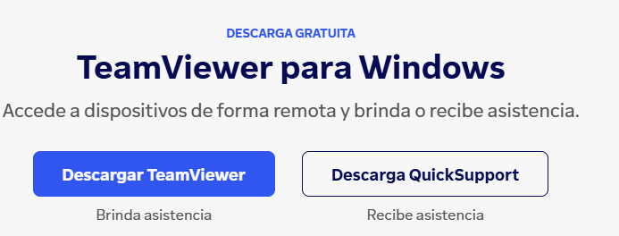

Una vegada descarregat, procedim a la instal·lació seguint els passos de l'assistent d'instal·lació.

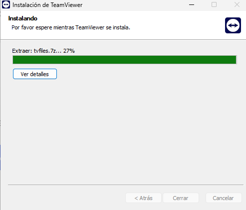

En finalitzar la instal·lació, obrim l'aplicació i ens demana que acceptem la llicència d'ús de TeamViewer.

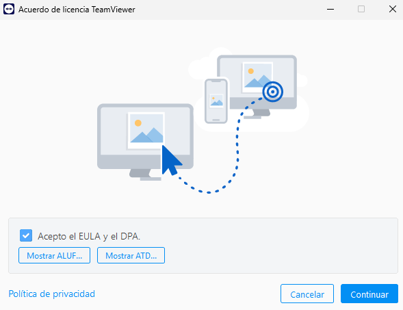

I acceptem les noves funcions que ens ofereix TeamViewer.

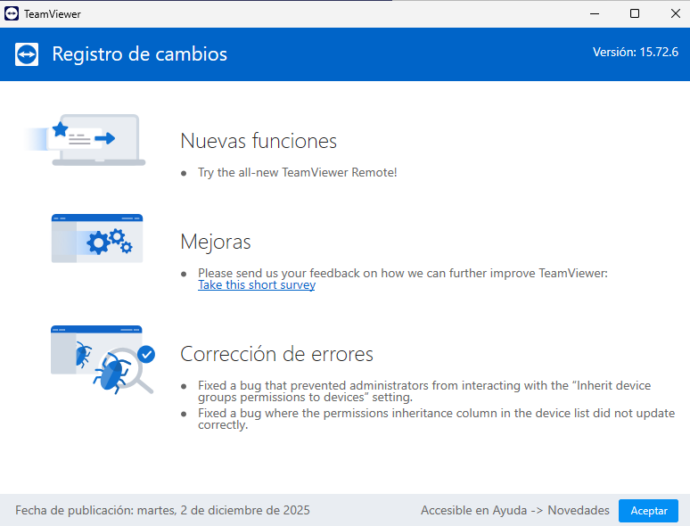

Ens apareix el panell principal de TeamViewer, on podem veure el nostre ID i contrasenya en cas de que necessitéssim rebre assistència, pero l'opció que ens interessa és la de donar assistència remota a un altre usuari, així que iniciem sessió amb les credencials del nostre compte de TeamViewer.

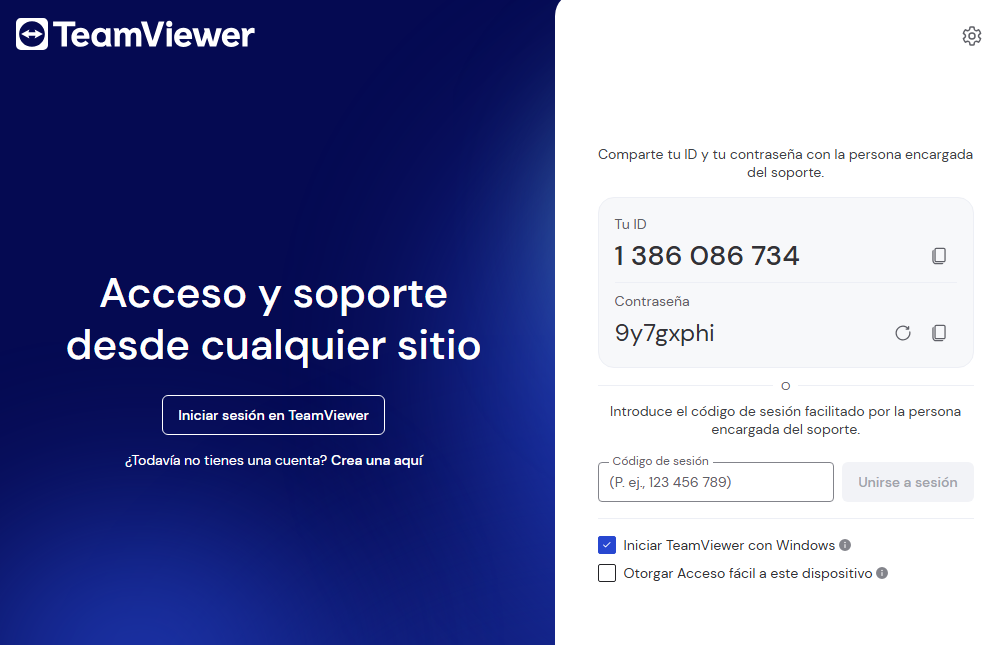

I escollim iniciar sessió amb el nostre compte Google per a més comoditat.

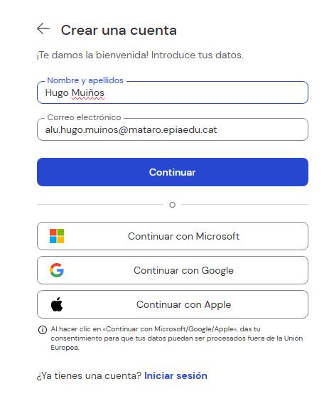

Una vegada dins de l'aplicació, ja podem començar a donar assistència remota als usuaris finals.

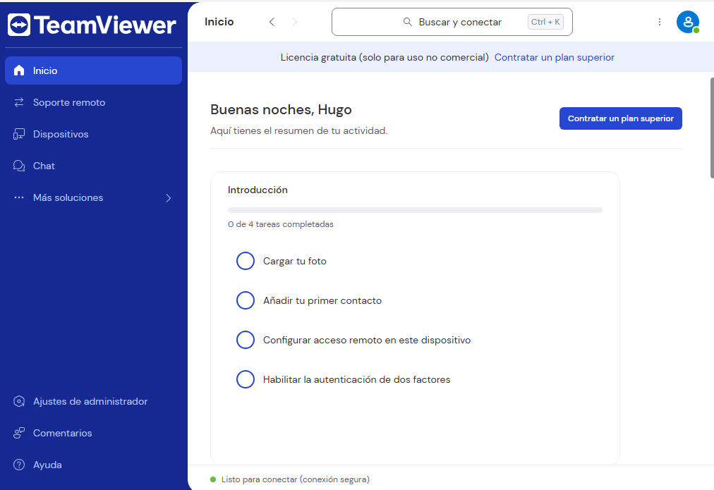

---

## 2. Proceso de Asistencia Remota

Para poder dar asistencia remota a un usuario final, primero debemos pedirle que descargue y ejecute el módulo `TeamViewer QuickSupport` desde la página oficial de TeamViewer. 

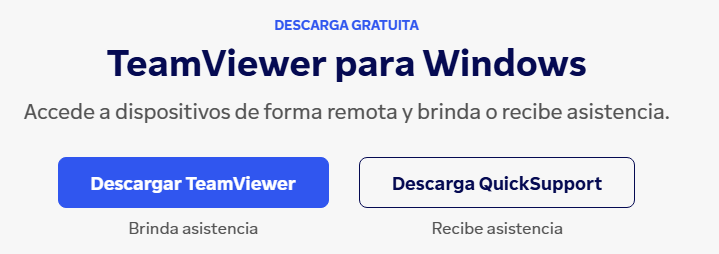

---

## 2.1 Conexión Remota a través del ID y Contraseña

Una vez que el usuario final ha ejecutado el módulo, le pedimos que nos facilite el ID y la contraseña que aparecen en la ventana de QuickSupport. Y los introducimos en nuestra aplicación de TeamViewer en la sección de `Soporte remoto`.

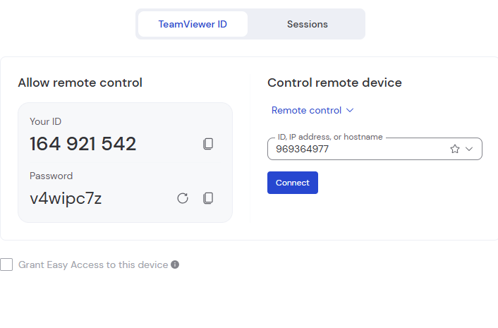

Una vez introducidos, hacemos clic en `Connectar` y se establecerá la conexión remota con el usuario, pudiendo ver y controlar su escritorio para ayudarle.

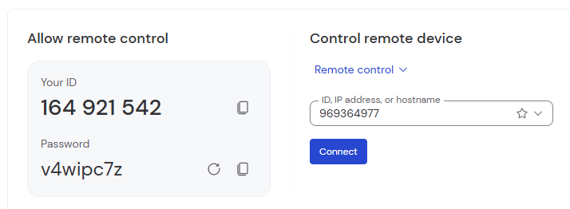

Aquí nos pide la contraseña que el usuario nos ha facilitado.

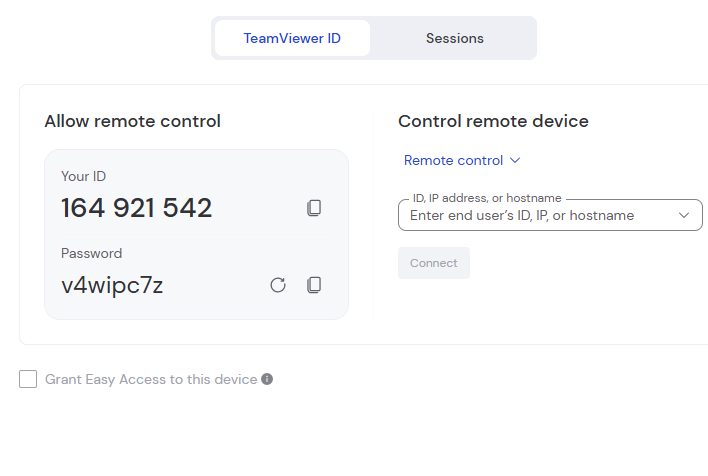

Y por último podemos ver que ya estamos conectados a su ordenador.

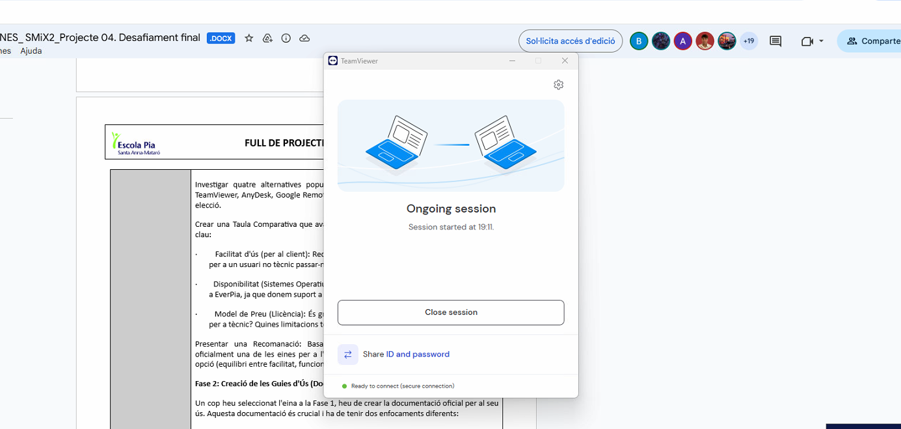

---

## 2.2 Conexión Remota a través de la sesión

También podemos conectarnos al ordenador del usuario a través de una sesión que deberemos crear desde la pestaña de `Sesiones` a la aplicación de TeamViewer dado al botón de `Nueva sesión`.

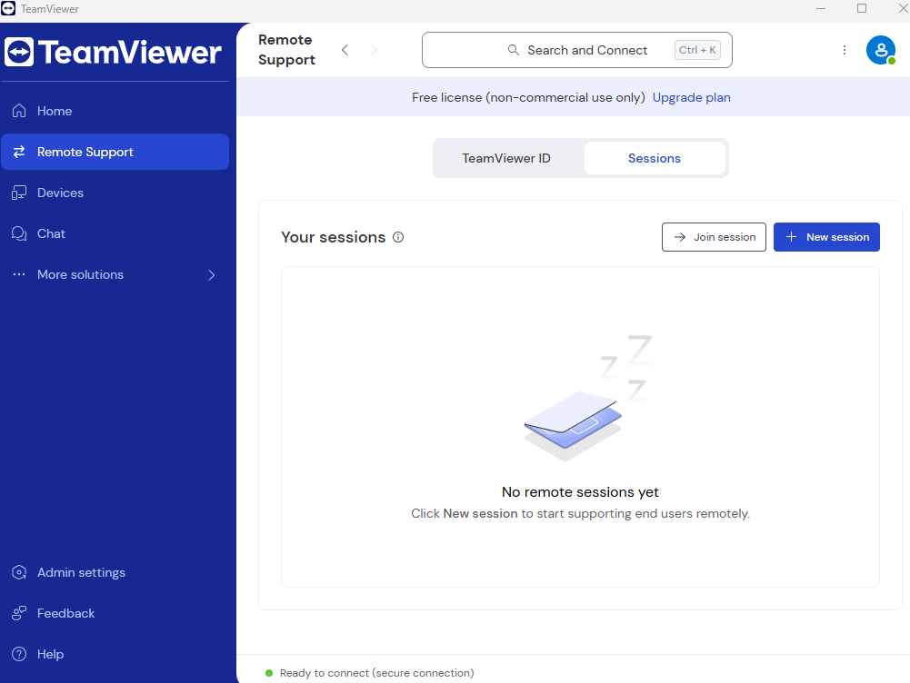

Una vez con la sesión creada, el usuario se puede conectar por un enlace que le proporcionamos o introduciendo el código de la sesión en su aplicación de TeamViewer QuickSupport.

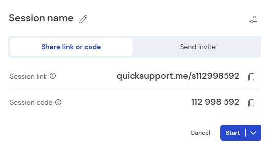

Y por último ya estamos conectados al ordenador del usuario.

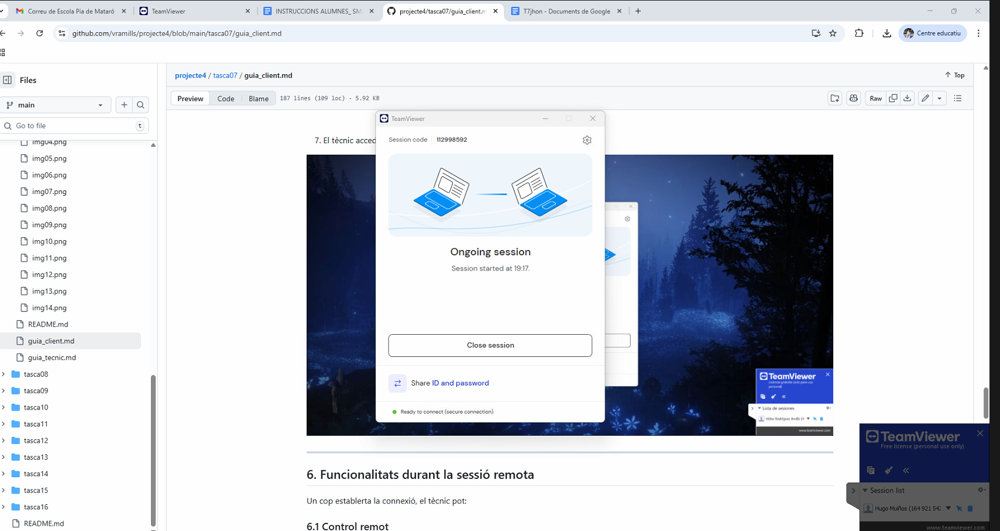

---

## 3. Funciones Adicionales

Una vez conectados, podemos utilizar varias funciones adicionales como transferencia de archivos, chat con el usuario, reinicio remoto, entre otros.

## 3.1 Ver información sobre el sistema del usuario (Panel)

Una de las funciones es poder ver la información sobre el sistema del usuario, para ello vamos a la barra superior y al primer icono, llamado `Panel`.  

Aquí podemos ver toda la información del sistema del usuario, como sistema operativo, procesador, memoria RAM, etc. Lo que es muy útil para diagnosticar problemas de su sistema.

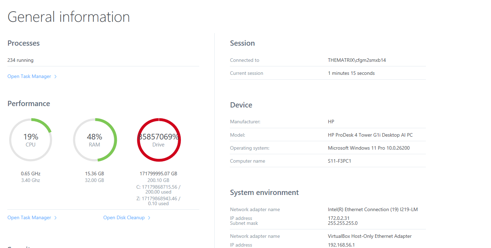

---

## 3.2 Enviar la secuencia de teclas Ctrl+Alt+Supr

El segundo icono es enviar la secuencia de teclas `Ctrl+Alt+Supr` al ordenador del usuario, que nos abrirá el gestor de tareas o la pantalla de bloqueo según el sistema operativo.

---

## 3.3 Transferencia de Archivos

Luego tenemos la función de transferencia de archivos, que nos permite enviar o recibir archivos entre nuestro ordenador y el ordenador del usuario. Para ello vamos al tercer icono, llamado `Transferencia de archivos`.

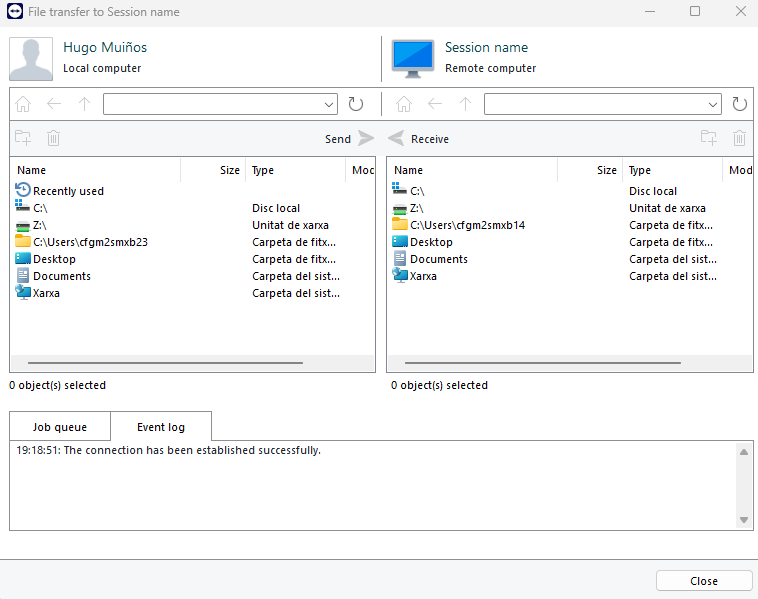

---

## 3.4 Reinicio Remoto del Ordenador

Con el cuarto icono, llamado `Reiniciar`, podemos reiniciar el ordenador del usuario de forma remota.

---

## 3.5 Función de Pizarra

También tenemos la función de `Pizarra` que nos permite dibujar sobre la pantalla del usuario para indicarle dónde debe hacer clic o qué opción debe seleccionar.

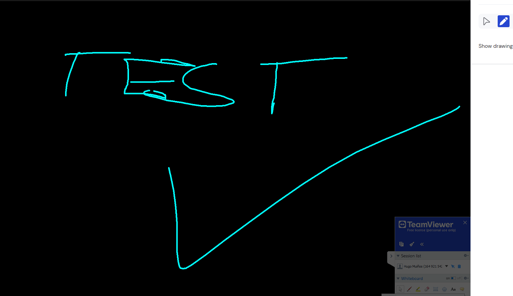

---

## 4. Buenas Prácticas de Seguridad

Para garantizar la seguridad durante las sesiones de asistencia remota, es importante seguir estas buenas prácticas:

- Cerciorarse de que el usuario está informado y ha dado su consentimiento antes de iniciar la sesión remota.
- No compartir las credenciales de acceso con personas no autorizadas.
- Finalizar la sesión remota inmediatamente después de completar la asistencia.
- Mantener el software de TeamViewer actualizado para beneficiarse de las últimas medidas de seguridad.

[Volver a enunciado](README.md)
