# Proyecto04: Servidor NFS

## El Caso Cliente: DevOptimize Solutions

Nuestro cliente, `DevOptimize Solutions`, es una pequeña startup de desarrollo de software que trabaja exclusivamente con Linux. Tienen un problema crítico: su código fuente y sus activos (documentos de diseño, scripts) están descontrolados. Cada desarrollador tiene copias locales, provocando errores de versión constantes y una pérdida de eficiencia brutal.
Nos han contratado para implementar un servidor de archivos centralizado. Dado que todo el entorno es Linux, la solución nativa, más rápida y eficiente del sector es NFS (Network File System).
El cliente ha insistido en que trabaja sin un entorno de autenticación centralizada y que, de momento, no tiene previsto dar este paso.

Para mostrar al cliente cómo quedará la solución propuesta a partir de sus demandas y poder mostrar también sus limitaciones, se te encarga realizar una demostración del sistema.

Crearás un servidor NFS (NFSv3) y un cliente Linux que consuma los recursos compartidos. Deberás crear usuarios y grupos para simular el entorno del cliente y demostrar el control de acceso utilizando las opciones de exportación (/etc/exports) y los permisos del sistema de archivos (chmod, chown).


---

# Fase 1: Preparación del entorno

Para empezar en esta guía debemos tener 2 máquinas, en cuyo caso tendremos un Ubuntu server y un zorin para simular el cliente.

Ambas máquinas deben tener 2 interfaces, la primera NAT y la segunda host only.

Una vez que ya tenemos las dos máquinas instaladas empezaremos configurando el servidor.

El primer pedido que haremos será para actualizar los paquetes.

```bash
sudo apt update && sudo apt upgrade -y 
```

Una vez que ya tenemos actualizado los paquetes, el siguiente paso será empezar con la creación de la estructura de carpetas, de grupos y usuarios.

---

# Fase 2: Preparación del servidor

Lo primero que haremos es crear los grupos necesarios. En este caso, se nos pide que creemos dos grupos: el primero es devs y el segundo es admin.

Para crear estos grupos, utilizaremos el siguiente comando:

```bash
groupadd devs
```

```bash
groupadd admin
```

Para comprobar que el archivo se ha creado correctamente, utilizaremos `grep` para buscar los grupos `devs` y `admin` dentro del archivo `/etc/group`. Para ello, ejecute el siguiente comando.

```bash
grep devs /etc/group
```

```bash
grep admin /etc/group
```

En el que podemos ver que los grupos se han creado correctamente.

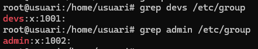

Una vez creados los grupos, el siguiente paso será crear el usuario dev01, que forma parte del grupo devs. Para ello, utilizaremos el siguiente comando.

```bash
useradd -G devs -m -s /bin/bash dev01
```

A continuación, haremos lo mismo con el usuario admin01, utilizando el siguiente comando:

```bash
useradd -G admin -m -s /bin/bash admin01
```

Para confirmar que se han creado correctamente, volveremos a utilizar grep.

```bash
grep dev01 /etc/passwd
```

```bash
grep admin01 /etc/passwd
```

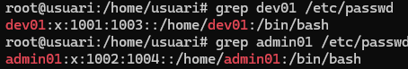

Una vez creados los grupos y los usuarios, el siguiente paso es crear el directorio para los proyectos de desarrollo, para lo cual la ruta solicitada es /srv/nfs/dev_projects. Para crear todas las carpetas con un solo comando, haremos lo siguiente:

```bash
mkdir /srv/nfs/dev_projects -p
```

```bash
mkdir /srv/nfs/dev_projects -p
```

Una vez hecho esto, crearemos el directorio para las herramientas de administración, que se ubicará en /srv/nfs/admin_tools

```bash
mkdir /srv/nfs/admin_tools
```

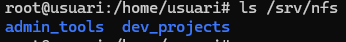

Por último, configuraremos los permisos de las carpetas, que en este caso serán los siguientes.

Chown para cambiar la propiedad de la carpeta

```bash
chown root:devs /srv/nfs/dev_projects
```

```bash
chown root:admin /srv/nfs/admin_tools
```

Una vez hecho esto, asignaré los permisos de las carpetas utilizando el comando chmod

```bash
chmod 2775 /srv/nfs/dev_projects
```

```bash
chmod 2775 /srv/nfs/admin_tools
```

Para comprobar que los permisos son correctos, ejecutaremos `ls -l` para ver los permisos de cada carpeta

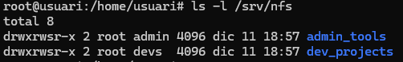

Antes de continuar con el servidor, crearemos los grupos y usuarios en la máquina cliente, en este caso una máquina Zorin.

Para crear los grupos y usuarios, utilizaremos la aplicación «Usuarios y grupos».

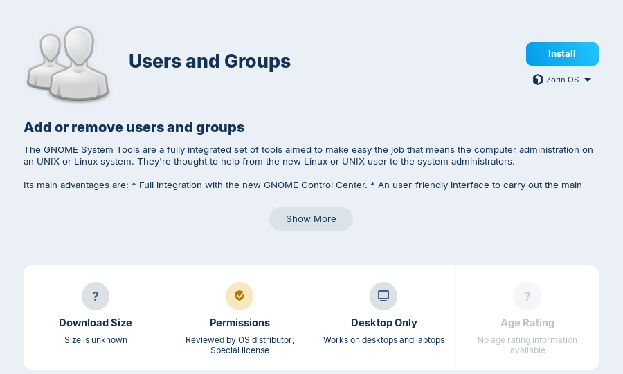

Para comprobar que todos los grupos se han creado correctamente, utilizaremos grep, tal y como hicimos antes.

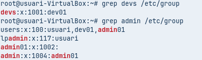

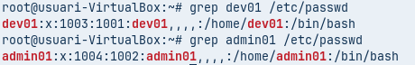

Tenemos que comprobar que los números UID y GID (los números de identificación) coinciden en ambos equipos.

Una vez hecho esto, instalaremos los paquetes de servicio NFS necesarios en el servidor. Para ello, ejecute el siguiente comando.

```bash
apt install nfs-kernel-server -y
```
Para comprobar que se ha instalado correctamente, podemos ejecutar `systemctl status`.

```bash
systemctl status nfs-kernel-server
```

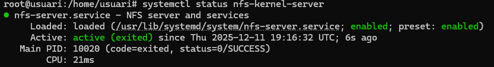

Para empezar, editaremos el archivo /etc/exports para decidir qué archivos queremos exportar. En este caso, queremos exportar toda la carpeta /srv/nfs.

Añadiremos una línea adicional al final del archivo, que en este caso será la siguiente:

```bash
/srv/nfs *(rw,sync,no_subtree_check)
```

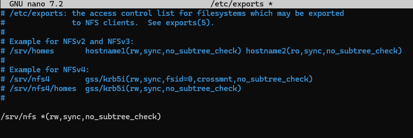

Para aplicar los cambios, tendremos que reiniciar el servicio con el comando

```bash
systemctl restart nfs-kernel-server
```
Una vez hecho esto, lo iniciaremos y comprobaremos que todo funciona correctamente 

En el servidor, podemos ejecutar el comando

```bash
exportfs -u
```
Esto nos mostrará qué archivos se pueden exportar.

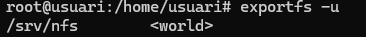

También podemos ejecutar el siguiente comando para ver en qué puerto está funcionando; en este caso, está utilizando el puerto 2049.

```bash
rpcinfo -p 192.168.56.101
```
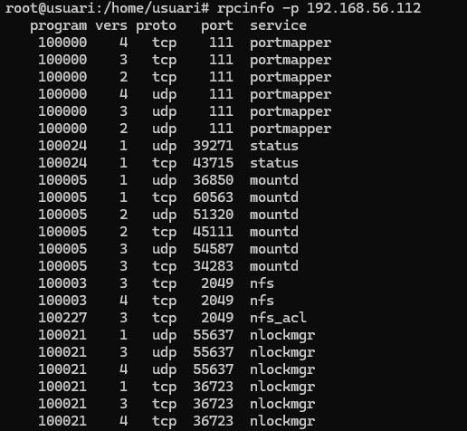

Para poder comprobarlo en la máquina, tendremos que instalar el paquete nfs-common. Lo haremos con el siguiente comando.

```bash
sudo apt install nfs-common -y
```

Una vez hecho esto, nos conectaremos al servidor con el comando `showmount -e IP`.

En mi caso, será el siguiente comando:

```bash
showmount -e 192.168.56.101
```

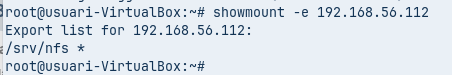

En el que podemos v

Traducción realizada con la versión gratuita del traductor DeepL.com

---

# Fase 3: La exportación de la administración (el dilema root_squash)

A continuación, ejecutaremos la prueba 1 (el error común)

Ya hemos exportado el archivo /srv/nfs, por lo que el siguiente paso es montar este recurso en la carpeta /mnt/admin_tools. Inicialmente, esta carpeta no existe, por lo que el primer paso es crearla. Lo haremos con el siguiente comando.

```bash
mkdir /mnt/admin_tools 
```

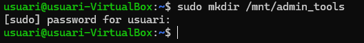

Una vez creada la carpeta, el siguiente paso es montar el recurso. Lo haremos utilizando el comando `mount`.

```bash
mount -t nfs 192.168.56.101:/srv/nfs/admin_tools /mnt/admin_tools
```

No podremos crear ningún archivo, ya que no tenemos los permisos necesarios, ya que el usuario root de la máquina cliente y el usuario root del servidor no son los mismos.

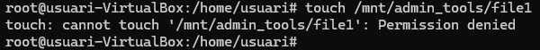

Sin embargo, si intentamos crear un archivo como usuario admin, podremos hacerlo, ya que este usuario sí tiene permisos en esta carpeta.

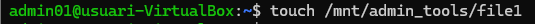

A continuación, te mostraré cómo crear archivos con root.

Prueba 2 (la solución)

Para empezar, tendremos que editar el archivo /etc/exports, en el que sustituiremos la línea que escribimos anteriormente por la siguiente.

```bash
/srv/nfs/admin_tools *(rw,sync,no_subtree_check,no_root_squash)
/srv/nfs/dev_projects *(rw,sync,no_subtree_check)
```

Una vez hecho esto, reinicia el servicio de nuevo con el comando 

```bash
systemctl restart nfs-kernel-server
```

A continuación, tendremos que desmontar y volver a montar el recurso; en mi caso, el comando para desmontar será 

```bash
umount -t nfs 192.168.56.112:/srv/nfs/admin_tools /mnt/admin_tools
```
Y para montarlo

```bash
mount -t nfs 192.168.56.112:/srv/nfs/admin_tools /mnt/admin_tools
```

Una vez hecho esto, podemos crear un nuevo archivo; en este caso, he creado un archivo llamado file2

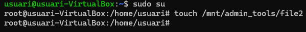

Esto se debe a que hemos modificado el archivo /etc/exports, haciendo que la raíz de la máquina física sea la misma que la raíz del servidor, por lo que tenemos total libertad. 

---

# Fase 4: La exportación de desarrollo (permisos rw frente a ro)

A continuación, el cliente solicita que la red de administración (por ejemplo, 192.168.56.0/24) pueda escribir, pero que la red de los consultores (por ejemplo, 192.168.56.100) solo pueda leer.

Para ello, tendremos que modificar el archivo /etc/exports y sustituir la línea «/srv/nfs/dev_projects *(rw,sync,no_subtree_check)» por la siguiente. 

```bash
/srv/nfs/dev_projects 192.168.56.0/24(rw,sync,no_subtree_check)
/srv/nfs/dev_projects 192.168.56.140(ro,sync,no_subtree_check)
```

```bash
systemctl restart nfs-kernel-server
```

Una vez hecho esto montamos el disco dev_projects para comprobar que funciona correctamente.

El primer paso sera crearlo con la suguiente comanda

```bash
mkdir /mnt/dev_projects
```

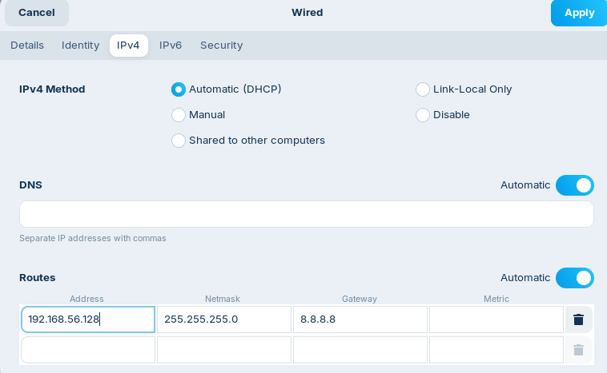

Una vez hecho esto, si iniciamos sesión como usuario dev01, como tenemos una dirección IP dentro del rango que puede editar archivos en la carpeta, podremos crear archivos.

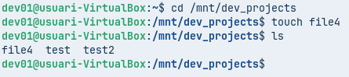

Cuando cambiamos la IP a ```192.168.56.140```, observamos que no podemos editar los archivos, pero sí podemos ver su contenido. Tendremos que desmontar y volver a montar la unidad.

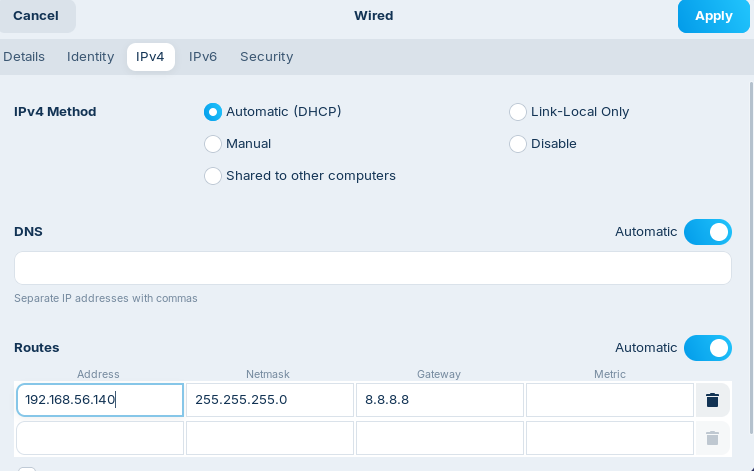

Podemos ver que podemos acceder a la carpeta y ver su contenido, pero no podemos modificarlo, ya que solo tenemos permisos de lectura.

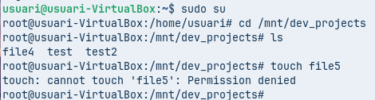

Por último, iniciaremos sesión con el usuario admin01 e intentaremos crear un archivo en la carpeta dev_projects.

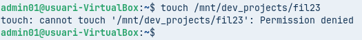

Podemos ver que no podemos crear ningún archivo dentro de la carpeta dev_projects, ya que no tenemos los permisos necesarios, ya que el usuario admin01 no es miembro del grupo dev01.

---

# Fase 5: Montaje automático con /etc/fstab


Ahora, modificaremos el archivo /etc/fstab para configurar los recursos compartidos de modo que no sea necesario montarlos cada vez que iniciemos sesión.

Para empezar, ejecute el siguiente comando para abrir el archivo:

```bash
sudo nano /etc/fstab
```

En el que tendremos que añadir estas dos líneas al final

```bash
192.168.56.101:/srv/nfs/admin_tools /mnt/admin_tools nfs defaults 0 0
192.168.56.101:/srv/nfs/dev_projects /mnt/dev_projects nfs defaults 0 0
```
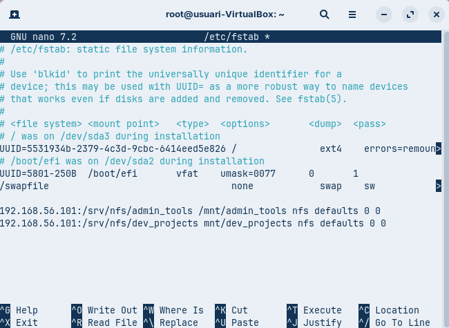

Una vez hecho esto, reinicie la máquina y confirme que los discos se han montado correctamente. 

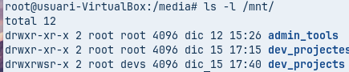

---

# Conclusión

Para mejorar este producto, podríamos mejorar lo siguiente. Por ejemplo, uno de los problemas es que los usuarios y grupos deben crearse tanto en el servidor como en la máquina cliente. Esto no es óptimo, ya que en un entorno real podría haber más de 20 equipos cliente. Básicamente, se repetiría el mismo paso 21 veces (20 para los clientes y 1 para el servidor).

Una solución real a este problema sería centralizar los datos de usuarios y grupos en un único lugar, como LDAP, para evitar trabajo innecesario.
