# INSTALACIÓN DEL SISTEMA OPERATIVO LINUX

## INSTALACIÓN Y HARDWARE 

### En la primera imagen observamos donde asignaremos el nombre y al ruta del sistema operativo

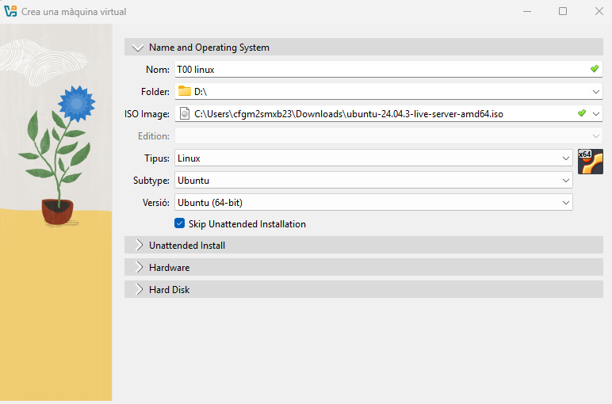

### En la segunda imagen es donde asignaremos la cantidad de hardware que queremos que utilice nuestra máquiuna virtual

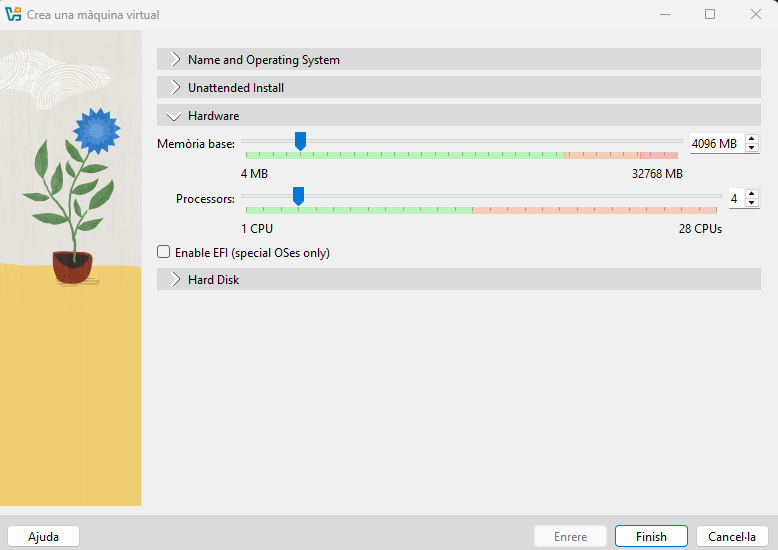

### En esta pantalla es dependiendo de las necesidades de cada uno, pero en nuestro caso que queremos instalar la máquina virtual escogeremos la primera opción

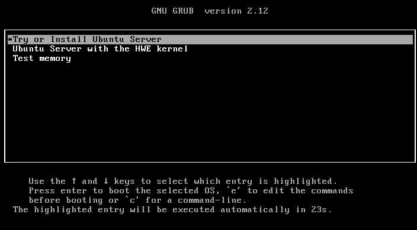

### En esta imagen como se puede deducir es donde escogeremos el idioma en el cual queremos que este nuestro sistema operativo

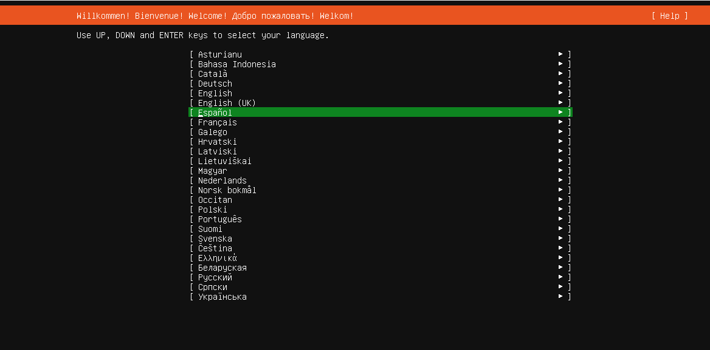

### En la siguiente imagen es casi lo mismo que la anterior pero en caso de que quermos escoger una variante del idioma aquí se puede elegir

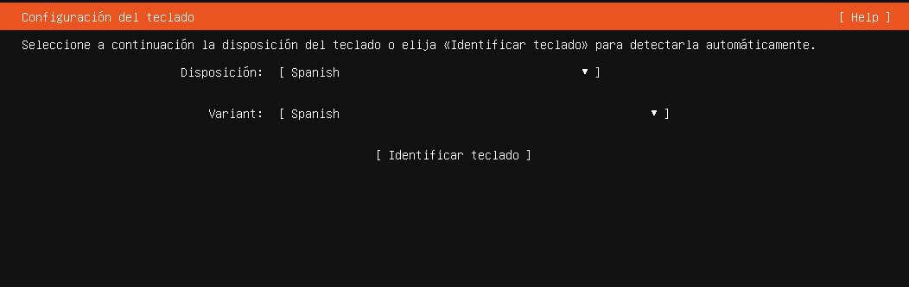

### En la siguiente imagen nos deja elegir el tipo de instalación que queremos

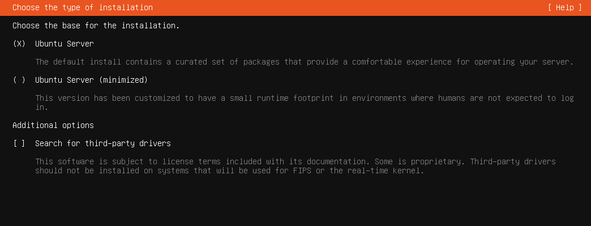

### En este apartado se asignan las IP a los adaptadores de red que tengamos puestos

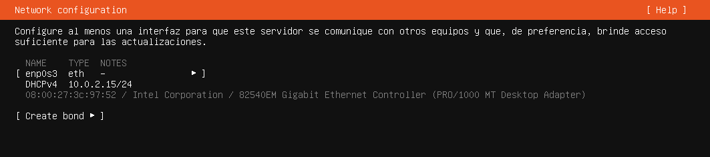

### En el caso de que queramos conectarnos a partir de un PROXY

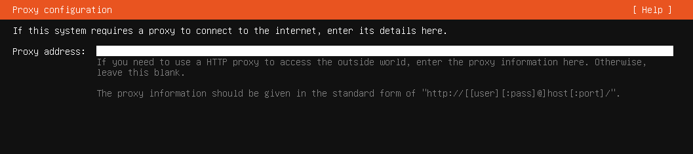

### En esta imagen se observa de donde se descargara nuestra sistema operativo

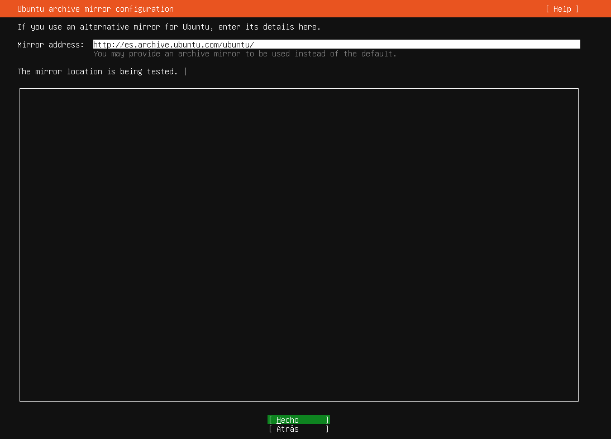

### En esta imagen se observa que nos da a elegir el disco que quermos que se use para instalar y tenemos la opción de configurar la cantidad de alamacenamiento

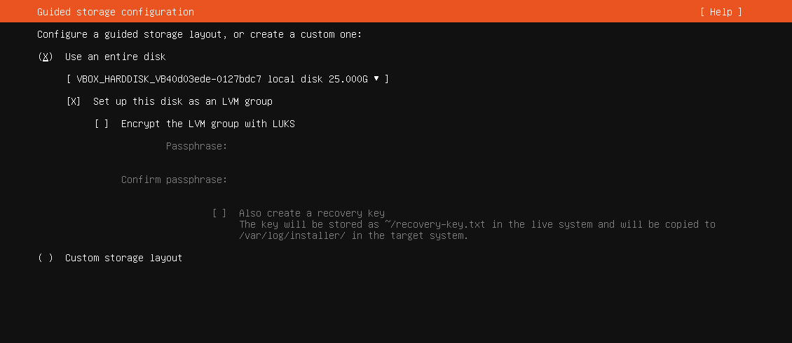

### En este apartado se observa que nos hace un resumen de lo que llevamos de la instalación, para si queremos cambiar alguna cosa aún estar a tiempo antes de seguir

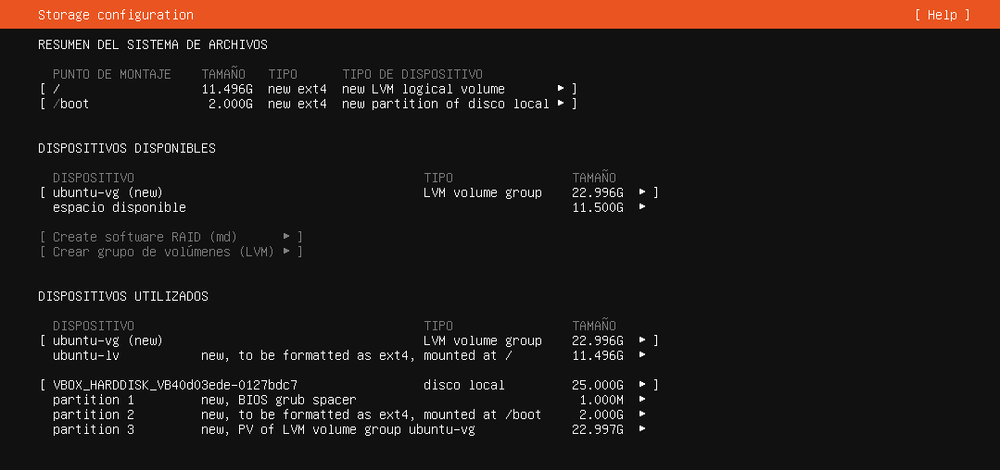

### En esta imagen observamos que el propio sistema nos da un mensaje de advertencia diciendonos que si estamos seguros de seguir con la instalación

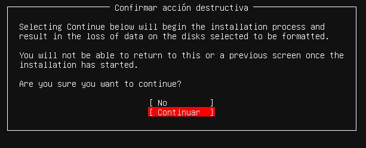

### Al instalarse nos saldrá esta pantalla donde asignaremos el nombre de usuario y de dominio que tendra nuestro Linux y la contraseña que quedremos que tenga

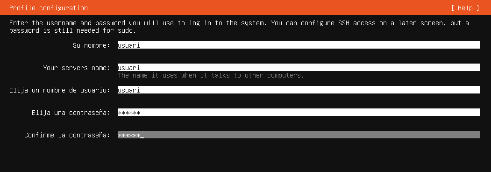

### Este apartado de la instalación nos ofrecen instalarnos el Ubuntu Pro (es de pago)

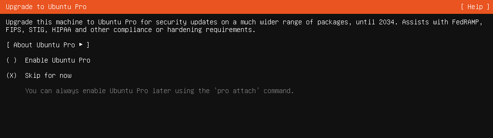

### En esta imagen la instalación nos ofrece que nos instalemos el servidor OpenSSH el cual es muy recomendable instalarlo

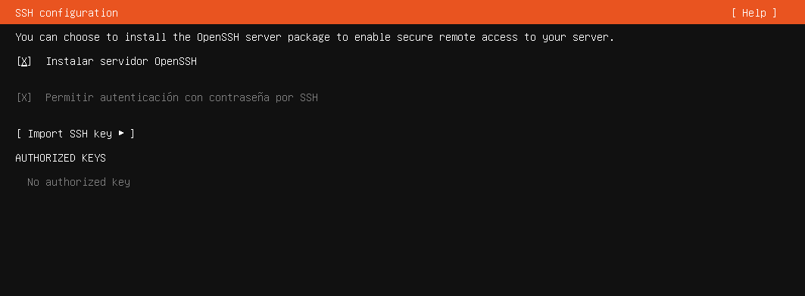

### En esta imagen la instalación nos ofrece que nos ofrece diferentes servicios los cuales dependiendo del contexto en el que necesites la máquina pueden llegar a ser muy útiles

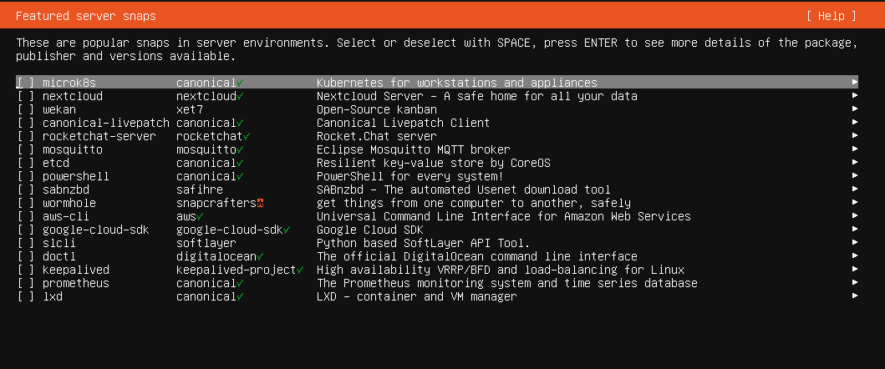

### En esta imagen observamos que se está instalando el sistema operativo 

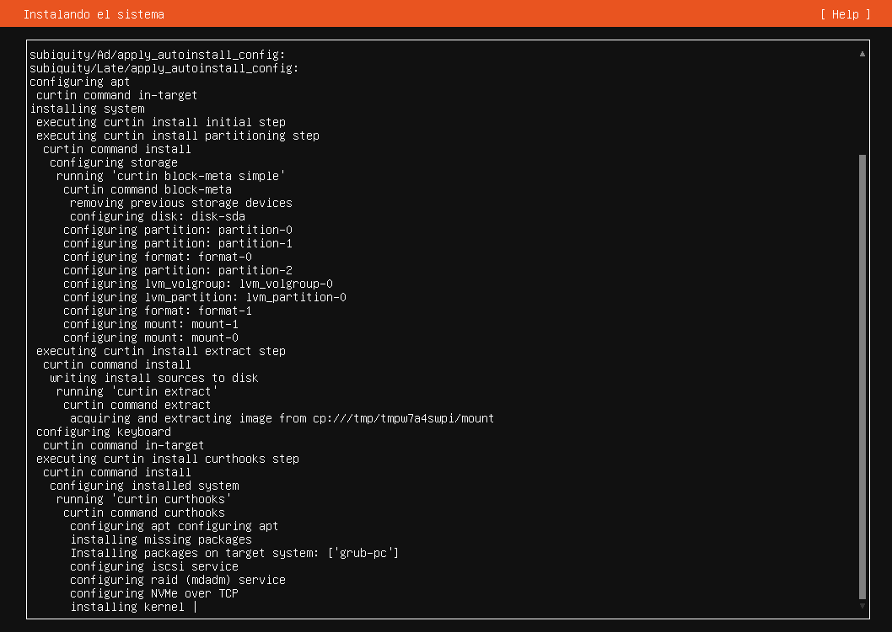

### En el caso de que os aparezca esta alerta simplemente con apretar "enter" deberíamos de seguir sin ninguno tipo de problema 

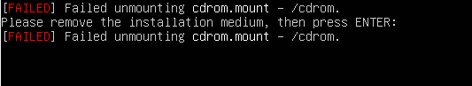

### Y finalmente observamos que nos aparece una pantalla que claramente se ve que es el inicio de sesión de la máquina, resumidamente, ya estamos.

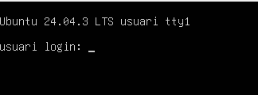

